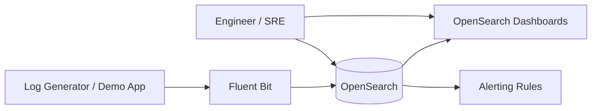

# OpenSearch Observability Stack v2

Portfolio-grade observability stack demonstrating **centralised logging, index templating, alerting concepts, dashboards, and synthetic traffic generation** using OpenSearch. This version is designed to communicate practical engineering judgment rather than just “Docker Compose works”.

## What this project shows

- Structured JSON logging
- Centralised search and troubleshooting
- Index template management
- Synthetic load generation
- Operational dashboard concepts
- Alerting examples
- Basic retention and architecture thinking

## Architecture



## Why this matters

In real environments, observability is not just dashboards. It is how teams:

- detect regressions
- correlate incidents
- investigate failures
- understand throughput and latency trends
- support security and operational workflows

This repo is inspired by production-style patterns, including high-ingestion thinking and schema awareness.

## Repository structure

```text
.
├── alerts/
│   └── sample-alerts.md
├── dashboards/
│   └── recruiter-demo-dashboard.md
├── docker-compose.yml
├── fluent-bit/
│   ├── fluent-bit.conf
│   └── parsers.conf
├── generators/
│   ├── app_log_generator.py
│   └── replay_burst.py
├── opensearch/
│   ├── bootstrap-index-template.sh
│   └── index-template.json
└── screenshots/
    └── README.md
```

## Quick start

```bash
docker compose up -d
python3 generators/app_log_generator.py
```

Optional burst simulation:

```bash
python3 generators/replay_burst.py --events 5000
```

Bootstrap the index template:

```bash
bash opensearch/bootstrap-index-template.sh
```

## Example operational scenarios

- Rising 5xx errors in the `api` service
- Elevated latency for one service tier
- Throughput spike triggering indexing pressure
- Search by `request_id` to trace individual events

## Suggested recruiter demo flow

1. Start the stack
2. Generate logs for a few minutes
3. Trigger a burst workload
4. Show dashboards or screenshots
5. Walk through how you would detect and triage an incident

## Production-minded considerations

### Scale and retention
At higher ingestion rates, design choices start to matter:

- shard counts
- rollover strategy
- retention windows
- tiered storage
- replica policies
- query patterns

### Security
A production deployment should add:

- TLS
- authentication and authorisation
- hardened cluster settings
- network isolation
- snapshot strategy

## Suggested v3 enhancements

- multi-node cluster variant
- ISM / rollover policies
- Prometheus exporter integration
- alert webhooks
- threat-detection style dashboards
- synthetic application container with richer error modes

## Notes

This repo is intentionally portfolio-focused: clean enough for demonstration, realistic enough to signal operational depth.
